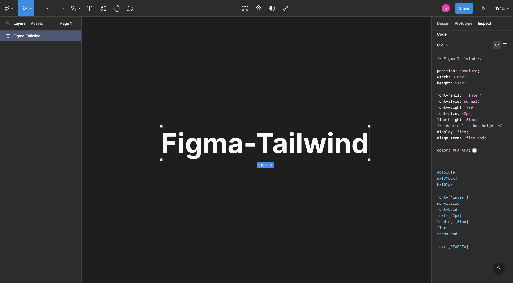

# Figma-Tailwind Chrome Extension


Figma-Tailwind is a powerful Chrome extension that seamlessly integrates Figma CSS code into Tailwind, enabling you to easily apply beautiful designs to your Tailwind-powered websites.

## Installation

To install Figma-Tailwind, follow these steps:

1. **Download** or **clone** the code from the [Figma-Tailwind GitHub zip](https://github.com/suman-majhi/figma-tailwind/archive/refs/heads/main.zip).
2. **Load** the extension in your Chrome browser by navigating to `chrome://extensions` in the address bar.
3. Enable the **Developer mode** (toggle switch located at the top right corner).
4. Click on the **"Load unpacked"** button.
5. **Select** the folder where you downloaded or cloned the Figma-Tailwind code.
6. The extension will now be **installed** and ready to use.

## Usage

Once the Figma-Tailwind extension is installed and activated, you just have to copy from the figma website side panel (yes its that easy)

you can also enjoy the following features:

- **Figma CSS to Tailwind**: Figma CSS code snippets are automatically converted into Tailwind utility classes, saving you time and effort.
- **Tailwind Panel**: A sleek panel will appear on the right side of figma website, displaying all the Tailwind utility classes applicable to the current element.
- **Easy Application**: Simply click on any Tailwind utility class in the panel to apply it instantly to the selected element on the website.

## Examples

Here are a few examples to demonstrate how Figma-Tailwind can enhance your Tailwind workflow:

### Example 1: Converting Figma CSS

```css
/* Figma CSS */

color: #ffffff;
background-color: #ff0000;
padding: 10px 20px;
border-radius: 4px;

/* Converted Tailwind CSS */

text-[#ffffff]
bg-[#ff0000] 
p-[10px_20px]
rounded-[4px]

```

### Example 2: Figma Side-Panel



The Figma website side-panel provides an intuitive interface for selecting and applying Tailwind utility classes directly on the website. Say goodbye to switching between figma and other website!

## Contributing
We welcome contributions from the open-source community. If you have any suggestions, bug reports, or feature requests, please submit an issue on GitHub.


## Support
Thank you for using Figma-Tailwind! We hope this extension enhances your Tailwind development experience. If you have any questions or need support, please don't hesitate to contact us.

## Disclaimer
This Chrome extension is a personal project and may not cover all Tailwind utility classes. It is a work in progress, and improvements will be made over time. Please use it with that understanding. We appreciate your support and feedback as we continue to enhance the functionality of this extension.

